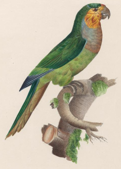

# Análisis de vocalización de *Aratinga pertinax*

Autores: Irene Zager, Jessica Eberhardt, Kathryn M. Rodríguez-Clark, and José R. Ferrer-Paris

**
[Ilustración 29](https://biodiversitylibrary.org/page/40194378) en [Monographie der Papageien : oder, Vollständige Naturgeschichte aller bis jetzt bekannten Papageien mit getreuen und ausgemalten ...](https://doi.org/10.5962/bhl.title.61090) de [Christian Ludwig Brehm](https://de.wikipedia.org/wiki/Christian_Ludwig_Brehm)

## Estructura del repositorio

### env
Archivos de configuración de entorno para usar en Linux/MAC OS.

### data
Conjuntos de datos para los análisis. Archivos de texto con valores separados por comas.

### R
Código en R para los análisis.

### doc
Documentos.

### assets
Archivos miscelaneos.
